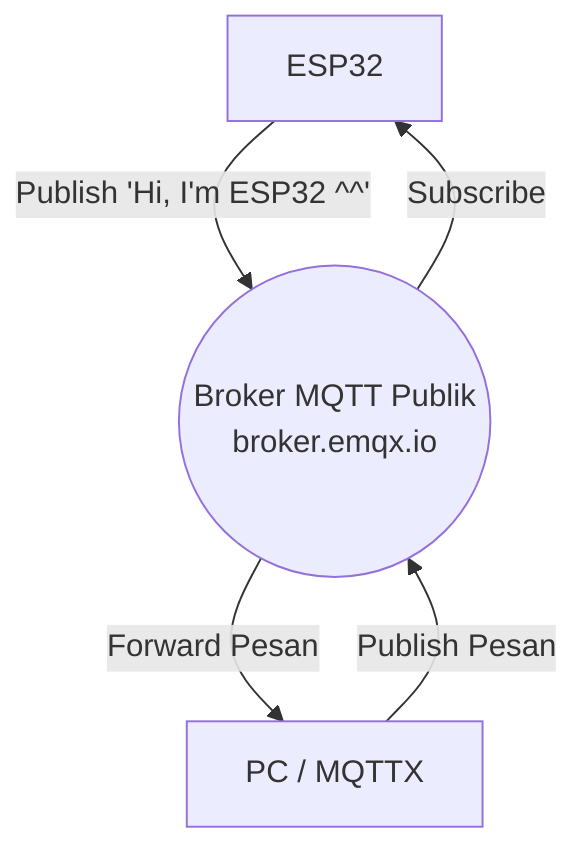
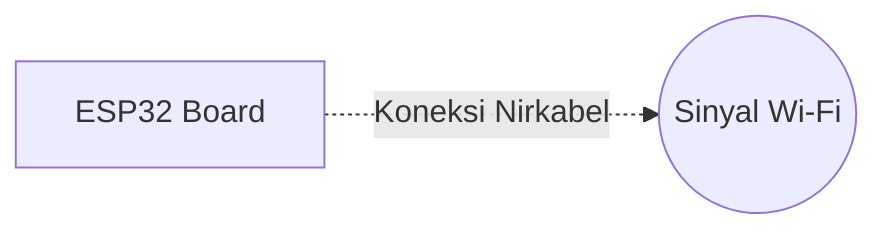

# Bab 1: Halo MQTT

Bab ini mendemonstrasikan konektivitas Wi-Fi dasar dan Publish/Subscribe MQTT pada ESP32 menggunakan broker publik (tanpa autentikasi).

### Tautan Kode Sumber
Anda dapat menemukan dan mengunduh file kode lengkapnya (`kode_mqtt.ino`) di URL berikut:
[https://github.com/YakubFahimLuckyarno/Kode_MQTT/blob/main/kode_mqtt.ino](https://github.com/YakubFahimLuckyarno/Kode_MQTT/blob/main/kode_mqtt.ino)

---

### Diagram Alir (Flowchart) Komunikasi

### Diagram Pengabelan (Wiring)
*(Pada tahap ini belum ada pengabelan khusus karena kita hanya menggunakan modul internal ESP32)*

