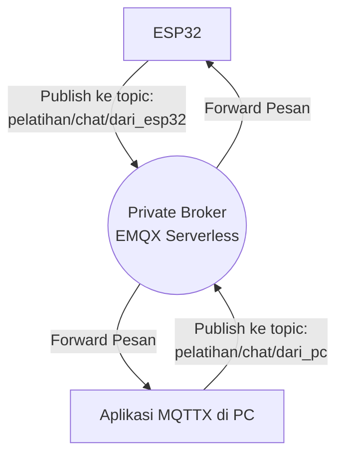
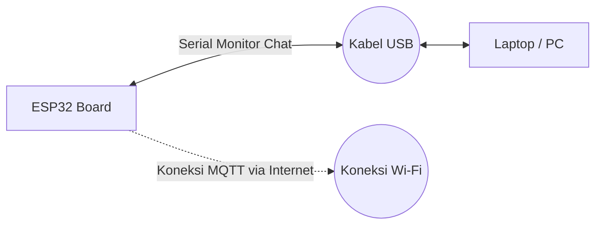

# Bab 2: Private Broker & Komunikasi Dasar

Bab ini membahas cara menggunakan EMQX Serverless untuk membuat Private MQTT Broker. Kita akan memisahkan lalu lintas pesan ke dalam dua topik berbeda agar tidak saling bertabrakan:
- ESP32 mem-publish ke `pelatihan/chat/dari_esp32`
- PC (MQTTX) mem-publish ke `pelatihan/chat/dari_pc`

### Diagram Alir (Flowchart) Komunikasi

### Diagram Pengabelan (Wiring)
*(Pada tahap ini belum ada pengabelan khusus karena kita baru mensimulasikan interaksi chat (teks) antara Serial Monitor dan MQTTX)*

