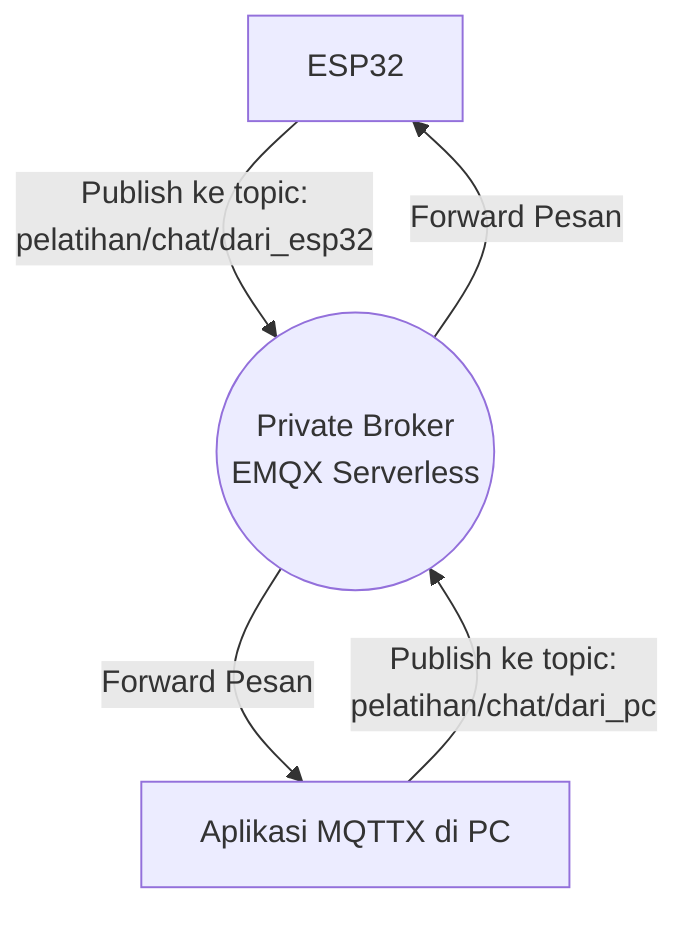
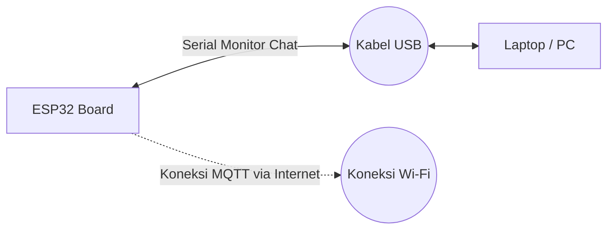

# Bab 2: Private Broker & Komunikasi Dasar

Bab ini membahas cara menggunakan EMQX Serverless untuk membuat Private MQTT Broker. Menggunakan broker privat jauh lebih aman dan dapat diandalkan dibandingkan broker publik yang sering kali di-*reset* atau mengalami *delay* karena digunakan oleh ribuan orang secara bersamaan.

Kita akan memisahkan lalu lintas pesan ke dalam dua topik berbeda agar tidak saling bertabrakan:
- ESP32 mem-publish ke `pelatihan/chat/dari_esp32`
- PC (MQTTX) mem-publish ke `pelatihan/chat/dari_pc`

---

## Panduan Membuat Private Broker EMQX (Serverless Gratis)

Berikut adalah langkah-langkah untuk mendapatkan *server* MQTT pribadi Anda sendiri:

1. **Mendaftar Akun:**
   - Kunjungi situs [EMQX Cloud](https://www.emqx.com/en/cloud).
   - Klik **Start Free** atau **Sign Up** di pojok kanan atas.
   - Isi detail pendaftaran Anda dan lakukan verifikasi email.

2. **Membuat Deployment (Server):**
   - Setelah masuk ke konsol (Dashboard EMQX Cloud), klik tombol **+ New Deployment**.
   - Pilih opsi **Serverless** (gratis selamanya dengan kuota 1 juta menit koneksi per bulan).
   - Pilih *Region* (wilayah server) yang paling dekat dengan Anda (misalnya: *Asia Pacific - Singapore* jika ada, atau *AWS/Google Cloud* default).
   - Klik **Deploy** dan tunggu beberapa saat hingga statusnya menjadi *Running*.

3. **Mengambil Informasi Koneksi (Mqtt Server & Port):**
   - Klik pada *deployment* yang baru saja Anda buat.
   - Di halaman *Overview*, perhatikan bagian **Connection Information**.
   - Salin **Connection Address** (misalnya `xxyyzz.emqxsl.com`). Ini akan dimasukkan ke variabel `mqtt_server` pada kode Arduino.
   - Perhatikan **Port** yang digunakan. Untuk koneksi biasa tanpa SSL gunakan **1883** (atau port khusus yang diberikan), dan untuk koneksi aman/SSL biasanya **8883** (atau port SSL spesifik EMQX Cloud, misal `15214`). Sesuaikan variabel `mqtt_port`.

4. **Membuat Kredensial Akses (Username & Password):**
   - Di menu sebelah kiri pada halaman *deployment* Anda, pilih **Authentication** -> **Authentication**.
   - Klik **+ Add** untuk membuat pengguna baru.
   - Masukkan *Username* (misalnya `user_esp32`) dan *Password* (misalnya `pass_esp32`).
   - Salin kredensial ini dan masukkan ke variabel `mqtt_user` dan `mqtt_pass` pada kode Arduino Anda.

Setelah selesai, Anda bisa menggunakan data tersebut baik di ESP32 maupun di aplikasi MQTTX di laptop Anda!

---

### Diagram Alir (Flowchart) Komunikasi

### Diagram Pengabelan (Wiring)
*(Pada tahap ini belum ada pengabelan khusus karena kita baru mensimulasikan interaksi chat (teks) antara Serial Monitor dan MQTTX)*

