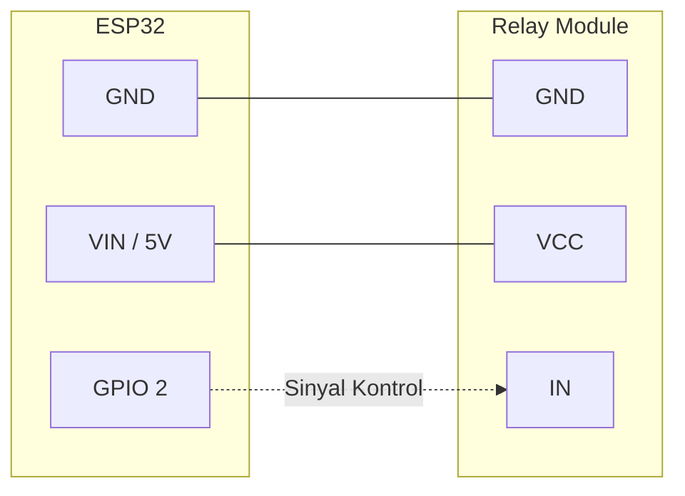

# Bab 3: Integrasi Relay & Umpan Balik Status

Bab ini mulai menghubungkan dunia maya dengan perangkat keras fisik (aktuator). ESP32 menerima pesan "ON" atau "OFF" dari topik `dari_pc`. ESP32 mengecek memori status terkininya. Jika ada perubahan perintah, maka relay diaktifkan, dan ESP32 mengirim konfirmasi balik ke topik `dari_esp32`.

### Diagram Alir (Flowchart) Komunikasi
```mermaid
graph TD
    PC[MQTTX di PC] -- Publish "ON" --> BROKER((Private Broker))
    BROKER -- Meneruskan --> ESP[ESP32]
    
    ESP -- Cek: Apakah relay sedang OFF? --> RELAY_ACT{Ubah State\nke ON}
    RELAY_ACT -- Ya, State Berubah --> CONFIRM[Publish "Status: LED MENYALA"]
    CONFIRM --> BROKER
    BROKER --> PC
```

### Diagram Pengabelan (Wiring)
*(Catatan: Dalam kode menggunakan LED bawaan GPIO 2 untuk simulasi. Wiring di bawah ini berlaku jika menghubungkan ke modul Relay sungguhan)*


