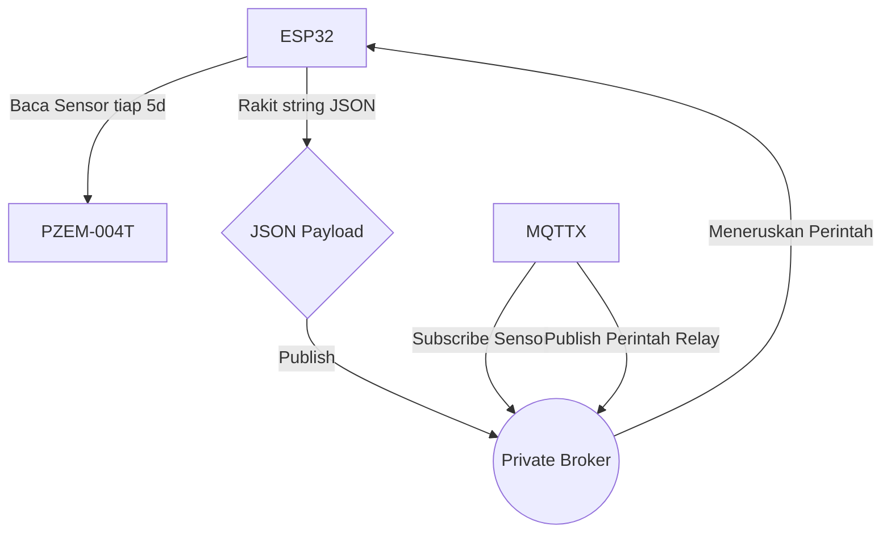
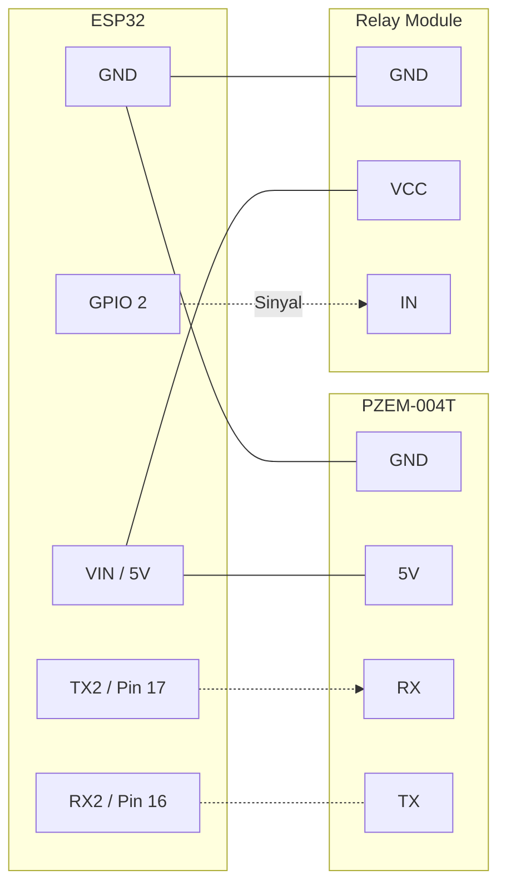

# Bab 4: Integrasi PZEM-004T & Topik Sensor

Di bab ini, kita menambahkan kemampuan membaca sensor arus AC nyata menggunakan PZEM-004T. Kita juga memperkenalkan perakitan format **JSON manual** (`{"tegangan": 220, "arus": 1.2}`) sehingga sistem cloud dapat dengan mudah mem-parsing variabel-variabel tersebut.

### Diagram Alir (Flowchart) Komunikasi

### Diagram Pengabelan (Wiring)

