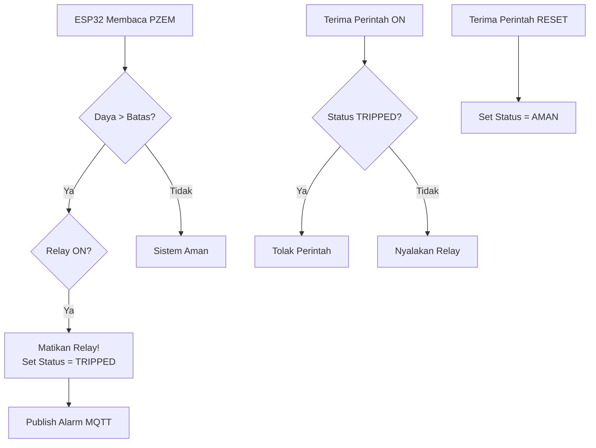
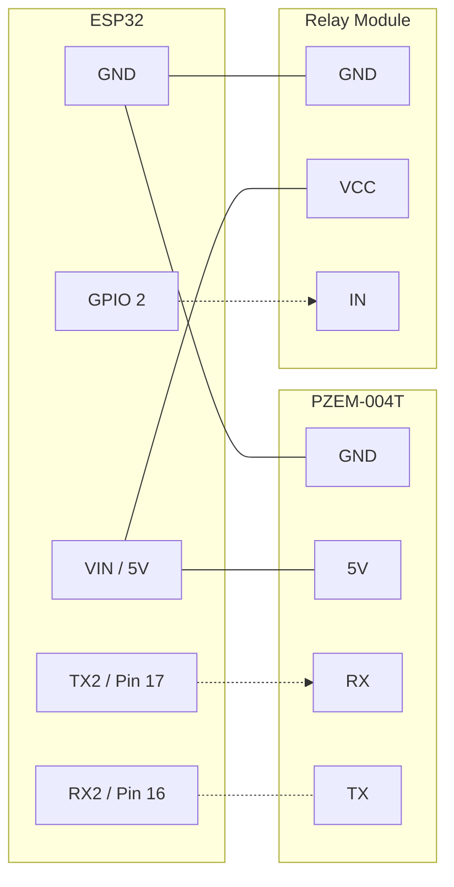

# Bab 5: Logika Pembatas Daya (Smart Trip)

Pada bab ini, kita menambahkan "otak" pada ESP32. ESP32 tidak lagi hanya pasif menerima perintah, melainkan secara aktif memonitor data sensor. Jika daya (Watt) melebihi batas yang dikonfigurasi, ESP32 akan **memutus relay secara otomatis** (seperti *Miniature Circuit Breaker* / MCB pintar).

Sistem akan terkunci (Trip) dan mengabaikan perintah "ON" sampai pengguna secara eksplisit mengirimkan perintah "RESET".

### Diagram Alir (Flowchart) Logika Trip

### Diagram Pengabelan (Wiring)
*(Sama seperti Bab 4, pengabelan fisik tidak berubah, hanya kecerdasan perangkat lunak yang bertambah).*

