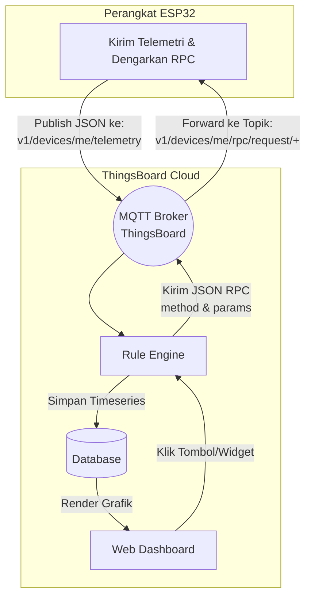
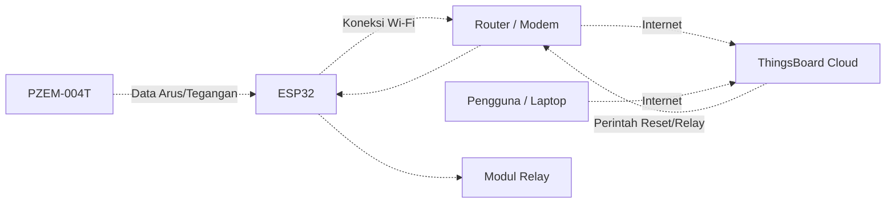

# Bab 6: Integrasi Dashboard ThingsBoard

Pada bab ini, kita akan menghubungkan ESP32 secara **langsung** ke MQTT Broker bawaan ThingsBoard. Ini akan menyederhanakan arsitektur kita sekaligus memungkinkan kita menggunakan fitur *Dashboard* interaktif untuk memonitor data dan mengontrol alat.

## Penyesuaian Kode (`thingsboard_integration.ino`)
Perbedaan utama dari kode Bab 5 adalah:
1. **Server MQTT:** Menggunakan `demo.thingsboard.io` (atau server khusus Anda).
2. **Kredensial:** Hanya menggunakan **Access Token** yang dimasukkan ke variabel `mqtt_user`. `mqtt_pass` dibiarkan kosong.
3. **Topik Standar:** ThingsBoard mewajibkan penggunaan topik khusus:
   - Telemetri (Publish): `v1/devices/me/telemetry`
   - RPC / Perintah (Subscribe): `v1/devices/me/rpc/request/+`
4. **Format Perintah (RPC):** Tombol dari dasbor ThingsBoard mengirimkan data berbentuk JSON seperti `{"method": "setRelay", "params": true}`.

---

## Panduan Langkah Demi Langkah (Web ThingsBoard)

1. **Membuat Perangkat (Device):**
   - Masuk ke akun [ThingsBoard](https://demo.thingsboard.io/).
   - Buka menu **Entities** -> **Devices**.
   - Klik tombol **+ Add Device** -> **Add new device**.
   - Beri nama perangkat (misalnya: `Smart Breaker 01`) dan klik Add.

2. **Mendapatkan Access Token:**
   - Klik perangkat yang baru saja dibuat di daftar.
   - Klik tombol **Manage credentials**.
   - Salin **Access Token**. Masukkan token ini ke dalam baris `const char* mqtt_user = "..."` di kode Arduino Anda.

3. **Membuat Dashboard & Grafik Telemetri:**
   - Buka menu **Dashboards** dan klik **+ Add Dashboard**.
   - Buka dashboard baru tersebut, lalu klik tombol pensil (Edit mode) di pojok kanan bawah.
   - Klik **Add new widget**. Pilih **Charts** -> **Timeseries Line Chart**.
   - Pada bagian *Datasource*, tambahkan *Entity* perangkat Anda, lalu pilih *data key* `tegangan`, `arus`, dan `daya`.

4. **Membuat Tombol Kontrol (RPC):**
   - **Tombol Sakelar (Relay):** Tambahkan *widget* **Control widgets** -> **Switch Control**. Di bagian *Advanced*, atur *RPC method* menjadi `setRelay`.
   - **Tombol Reset:** Tambahkan *widget* **Control widgets** -> **Round switch** (atau tombol sejenisnya) dan atur *RPC method* menjadi `resetSistem`.
   - **Input Batas Daya:** Tambahkan *widget* **Control widgets** -> **Knob Control** atau **Update Integer Attribute** dan atur *RPC method* menjadi `setBatasDaya`.

---

### Diagram Alir (Flowchart) Komunikasi ThingsBoard

### Topologi Jaringan (Wiring Logis)

