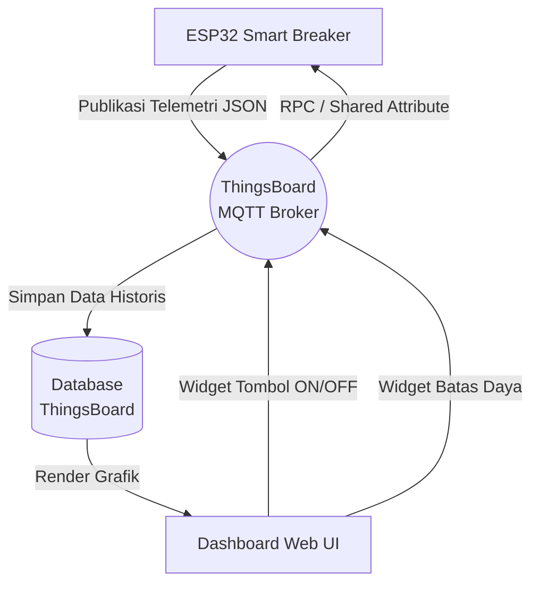
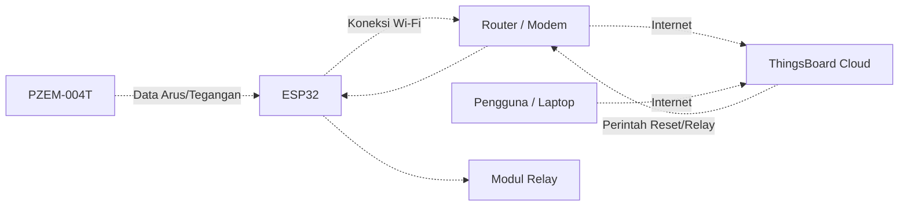

# Bab 6: Integrasi Dashboard ThingsBoard

Pada bab ini, kita akan meninggalkan klien MQTTX dan beralih ke platform *Internet of Things* profesional, yaitu **ThingsBoard**. Kita akan membangun antarmuka pengguna (UI) visual yang dapat diakses melalui peramban (browser) web.

> [!NOTE]
> Pada bab ini, Anda tidak perlu mengubah kode Arduino dari Bab 5, **kecuali** mengganti variabel `mqtt_server`, `mqtt_user`, dan topik agar sesuai dengan kredensial dari ThingsBoard Anda.

## Panduan Langkah Demi Langkah (Web ThingsBoard)

1. **Membuat Perangkat (Device):**
   - Masuk ke akun ThingsBoard Anda.
   - Buka menu **Entities** -> **Devices**.
   - Klik tombol **+ Add Device** -> **Add new device**.
   - Beri nama perangkat (misalnya: `Smart Breaker 01`) dan klik Add.

2. **Mendapatkan Kredensial Akses:**
   - Klik perangkat yang baru saja dibuat.
   - Klik tombol **Manage credentials**.
   - Salin **Access Token**. (Gunakan token ini sebagai `mqtt_user` di kode Arduino Anda).

3. **Membuat Dashboard & Grafik Telemetri:**
   - Buka menu **Dashboards** dan klik **+ Add Dashboard**.
   - Buka dashboard baru tersebut, lalu klik tombol pensil (Edit mode) di pojok kanan bawah.
   - Klik **Add new widget**. Pilih **Charts** -> **Timeseries Line Chart**.
   - Pada bagian *Datasource*, tambahkan *Entity* perangkat Anda, dan pilih data key `tegangan`, `arus`, dan `daya` (sesuai format JSON dari Bab 5).

4. **Membuat Tombol Kontrol (RPC / Shared Attribute):**
   - **Tombol Relay:** Tambahkan widget **Control widgets** -> **Switch Control**. Atur agar mengirim data RPC dengan *method* "ON" atau "OFF".
   - **Input Batas Daya:** Tambahkan widget **Input widgets** -> **Update Integer Attribute** atau **Update Shared Attribute** untuk mengubah nilai `batas_daya`.

### Diagram Alir (Flowchart) Integrasi Cloud

### Topologi Jaringan (Wiring Logis)

